| [./media/image1.png](./media/image1.png)                                                                                                       | **FORMATO DE INFORME DE PRÁCTICA DE LABORATORIO / TALLERES / CENTROS DE SIMULACIÓN – PARA ESTUDIANTES** |                                                                                                                                                                                                  |
|------------------------------------------------------------------------------------------------------------------------------------------------|---------------------------------------------------------------------------------------------------------|--------------------------------------------------------------------------------------------------------------------------------------------------------------------------------------------------|
|                                                                                                                                                |                                                                                                         |                                                                                                                                                                                                  |
| **CARRERA**: Computación                                                                                                                       | **ASIGNATURA**: Plataformas Web                                                                         |                                                                                                                                                                                                  |
| **NRO. PRÁCTICA**:                                                                                                                             | 2                                                                                                       | **TÍTULO PRÁCTICA**: Desarrollo de una aplicación JEE basado en Servlets, JSP y JDBC para el intercambio de datos en un modelo de tres capas aplicando los patrones diseño de software MVC y DAO |
| **OBJETIVO ALCANZADO:**                                                                                                                        |                                                                                                         |                                                                                                                                                                                                  |
| **ACTIVIDADES DESARROLLADAS**                                                                                                                  |                                                                                                         |                                                                                                                                                                                                  |
| **Crear un repositorio en GitHub con el nombre “Práctica de laboratorio 01: Servlets, JSP y JDBC”**                                            |                                                                                                         |                                                                                                                                                                                                  |
| **Desarrollar una aplicación con tecnología JEE para gestionar una agenda telefónica en la web.**                                              |                                                                                                         |                                                                                                                                                                                                  |
| **Realizar varios commits en la herramienta GitHub que demuestren el desarrollo de la aplicación.**                                            |                                                                                                         |                                                                                                                                                                                                  |
| **Generar el informe de la práctica con el desarrollo de cada uno de los puntos descritos anteriormente.**                                     |                                                                                                         |                                                                                                                                                                                                  |
| **Implementar el README del repositorio del proyecto con la misma información del informe de la práctica.**                                    |                                                                                                         |                                                                                                                                                                                                  |
| **Subir al AVAC el informe del proyecto en formato \*.pdf. El informe debe contar con conclusiones apropiadas y la firma de cada estudiante.** |                                                                                                         |                                                                                                                                                                                                  |
| **RESULTADO(S) OBTENIDO(S)**:                                                                                                                  |                                                                                                         |                                                                                                                                                                                                  |
| **CONCLUSIONES**:                                                                                                                              |                                                                                                         |                                                                                                                                                                                                  |
| **RECOMENDACIONES**:                                                                                                                           |                                                                                                         |                                                                                                                                                                                                  |

-   **Desplegar una aplicación para una agenda telefónica que funciones en JEE
    usando los Servlets y JDBC**

-   **Diseñar el sistema de agenda telefónica en base a los patrones de diseños
    del software MVC y DAO.**

-   **Generar formularios que registren usuarios y datos que podrán ser
    posteriormente modificados cuando se inicie sesión.**

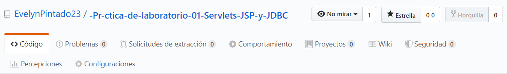

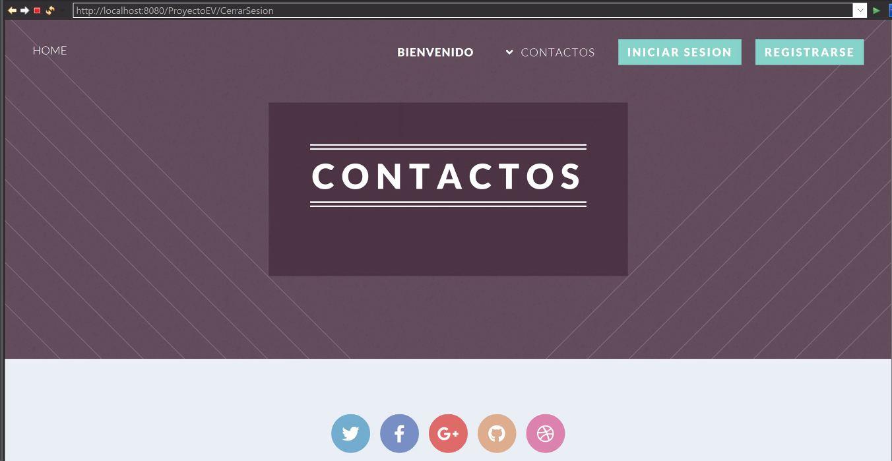

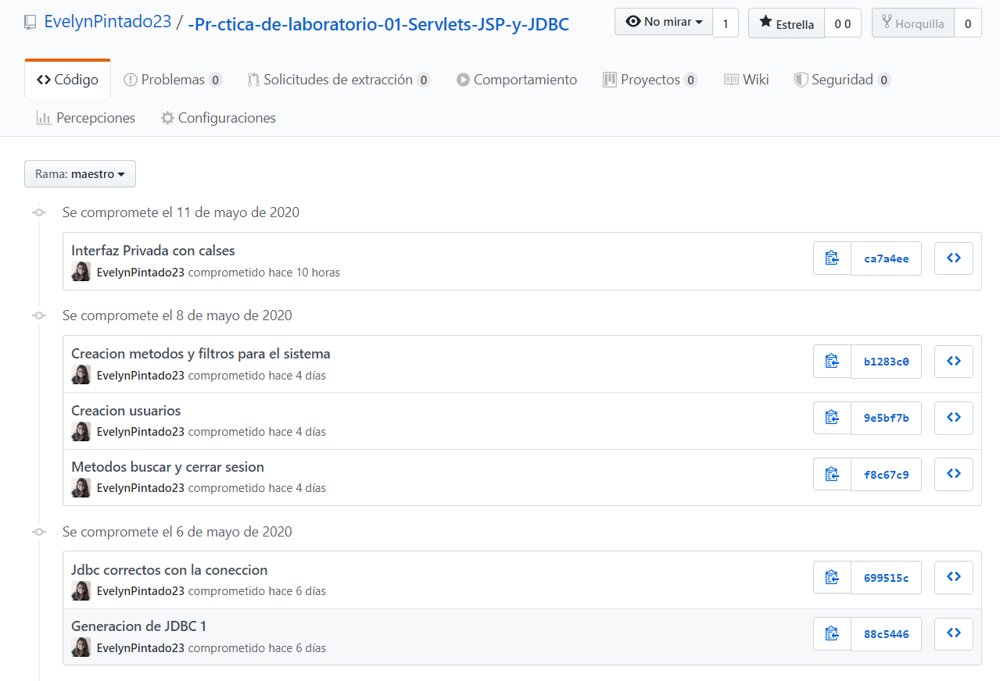

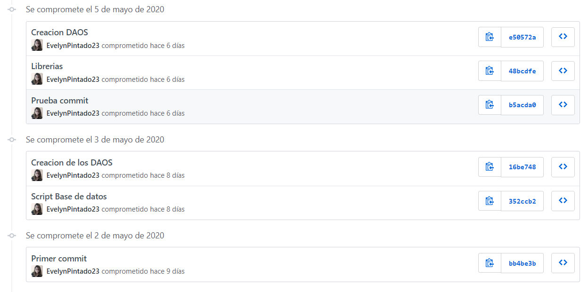

-   **Implementara una agenda telefónica donde se tendrán usuarios con los
    siguientes datos: cedula, nombres, apellidos, correo y contraseña.**

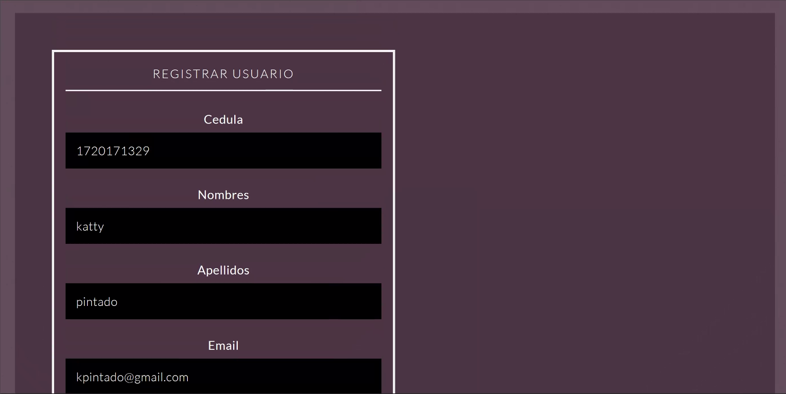

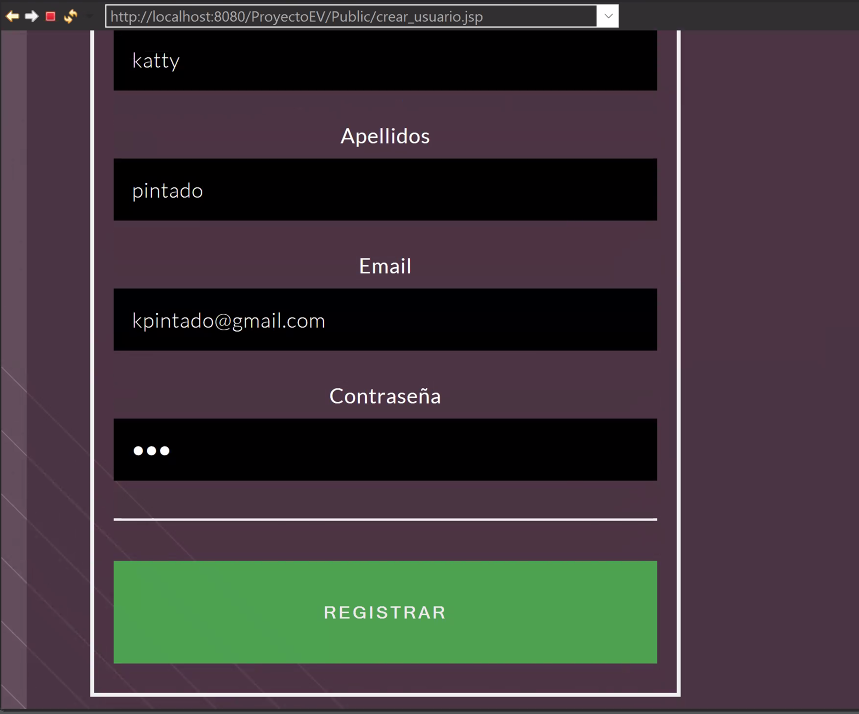

-   **Listar que un usuario tenga uno o más teléfonos de diferente tipo y
    operador.**

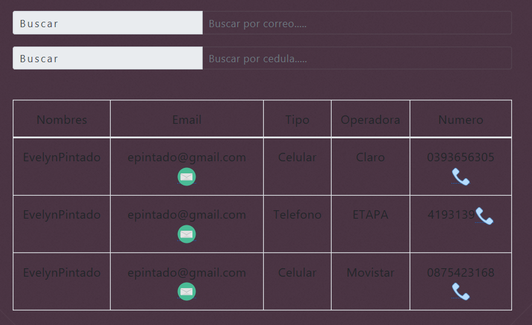

-   **Usuarios se pueden registrarse a través de un formulario de creación de
    cuentas.**

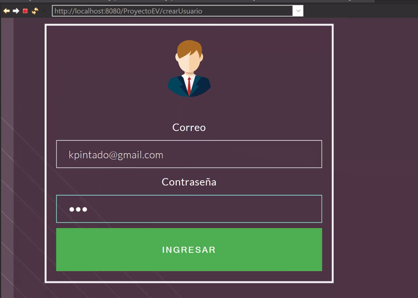

-   **Iniciar Sesión con su correo y contraseña.**

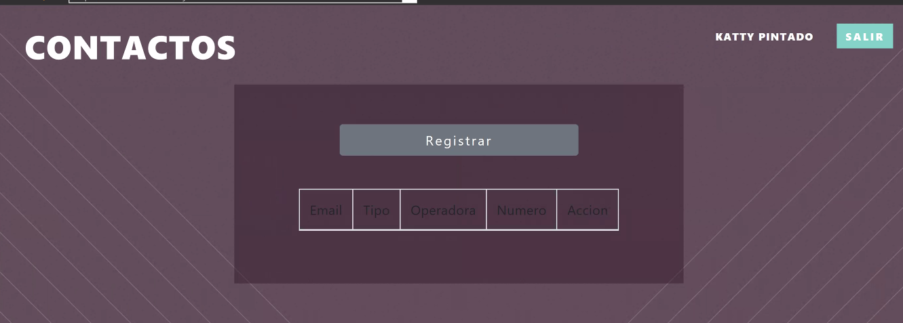

-   **Una vez dentro la sesión podrá: registra, modifica, elimina, busca, y
    lista los teléfonos**

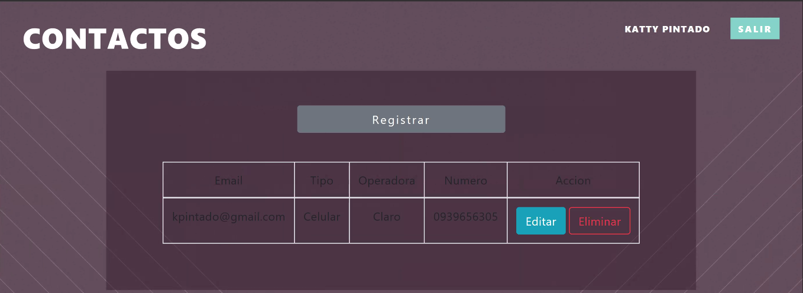

-   **Listar números de teléfono usando su número de cédula y correo
    electrónico.**

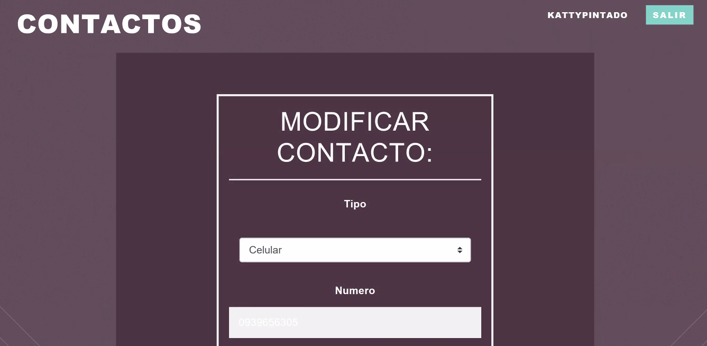

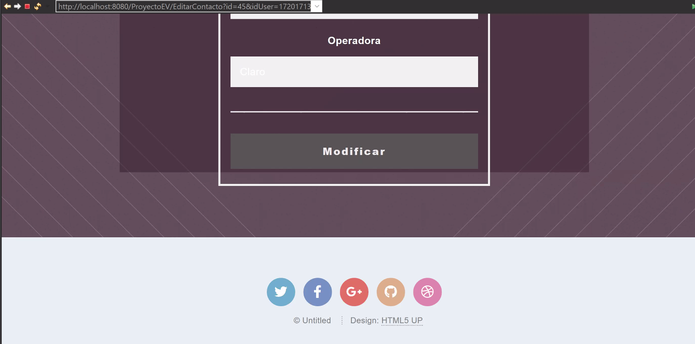

-   **Llamar o enviar correos electrónicos desde el sistema a aplicaciones
    externas.**

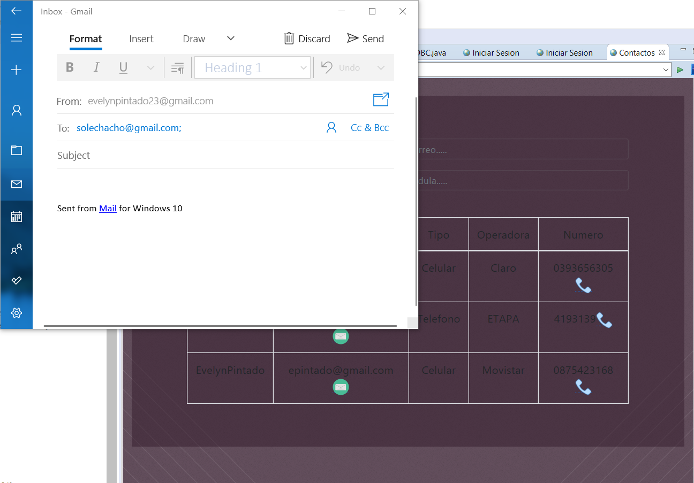

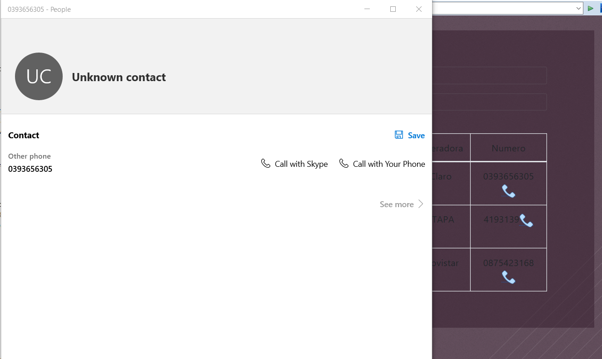

-   **Los datos deberán ser validados en los formularios**

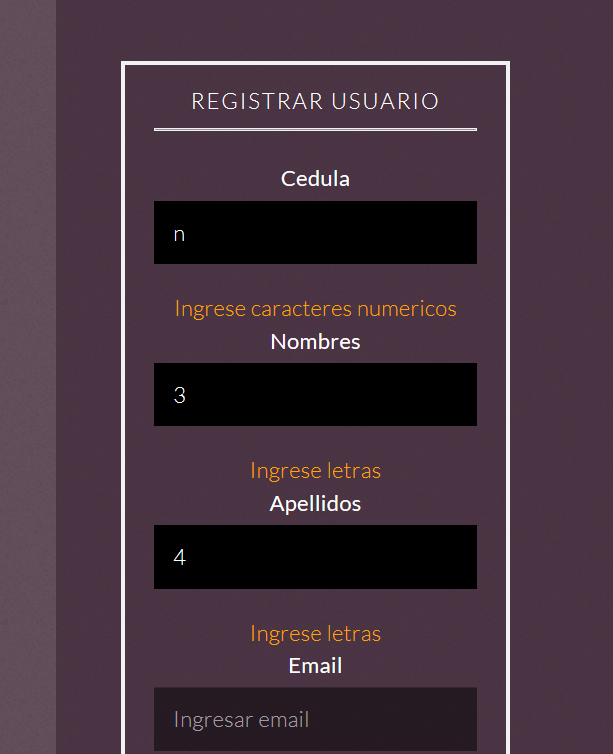

-   **Manejo de sesiones y filtros para la seguridad del sistema**

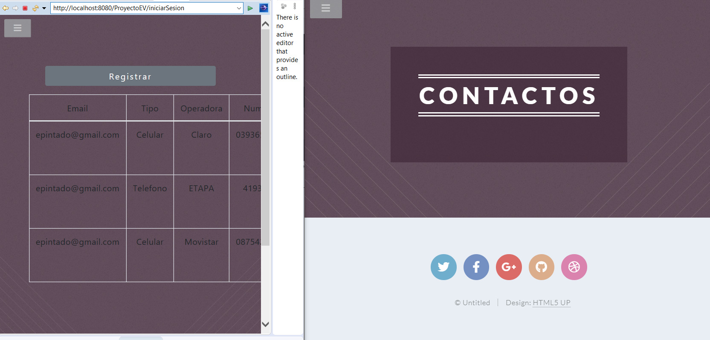

-   **Parte pública y parte privada.**

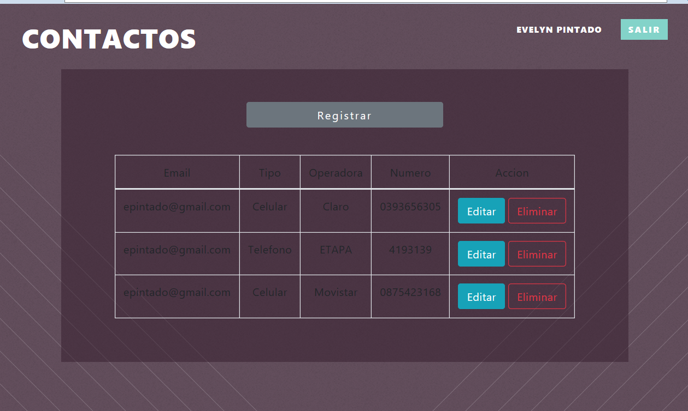

-   **Este trabajo nos ha demostrado la manera correcta para el uso de DAOS y
    JDBC en JEE utilizando Servlets y JSP.**

-   **Se trabajó en diferentes formatos para ver como cambian los datos entre
    las aplicaciones.**

-   **Se conecto una aplicación externa con nuestro sistema.**

-   **Se recomienda usar la aplicación determinada del correo dentro de su
    propio computador. el sistema se conecte con el sistema de manera correcta,
    porque al realizar esta acción en cualquier navegador pondrían existir
    errores.**

-   **Es mucho más fácil comenzar trabajando con los DAOS al comienzo del
    desarrollo de la aplicación, luego las modelos y el JDBC para terminar con
    los controladores para los métodos y al final la interfaz como medio de
    optimización de tiempo.**

**Nombre de estudiante: Evelyn Pintado Ch.**

**Firma de estudiante:**

